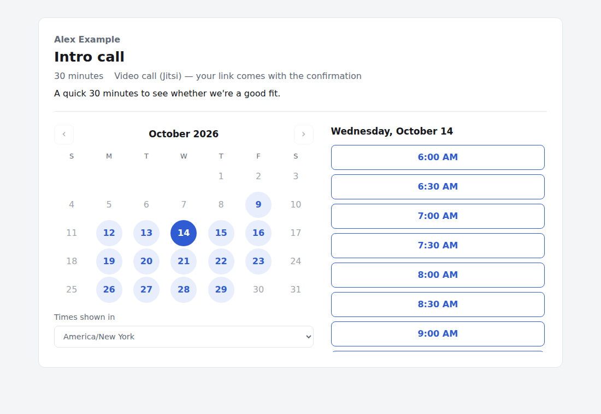
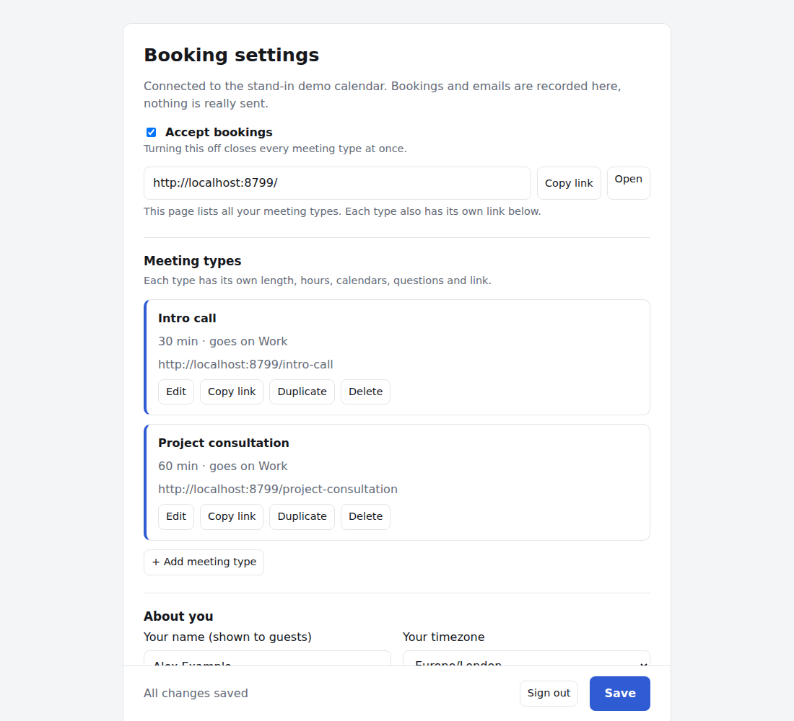
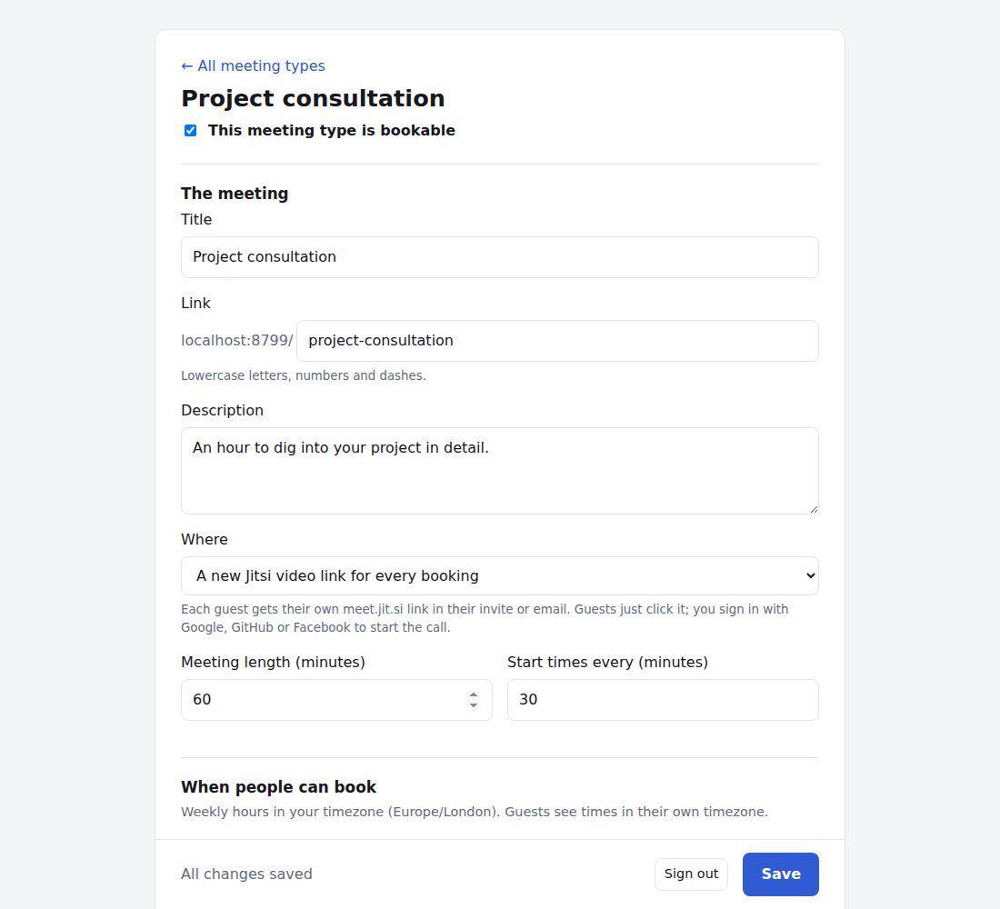
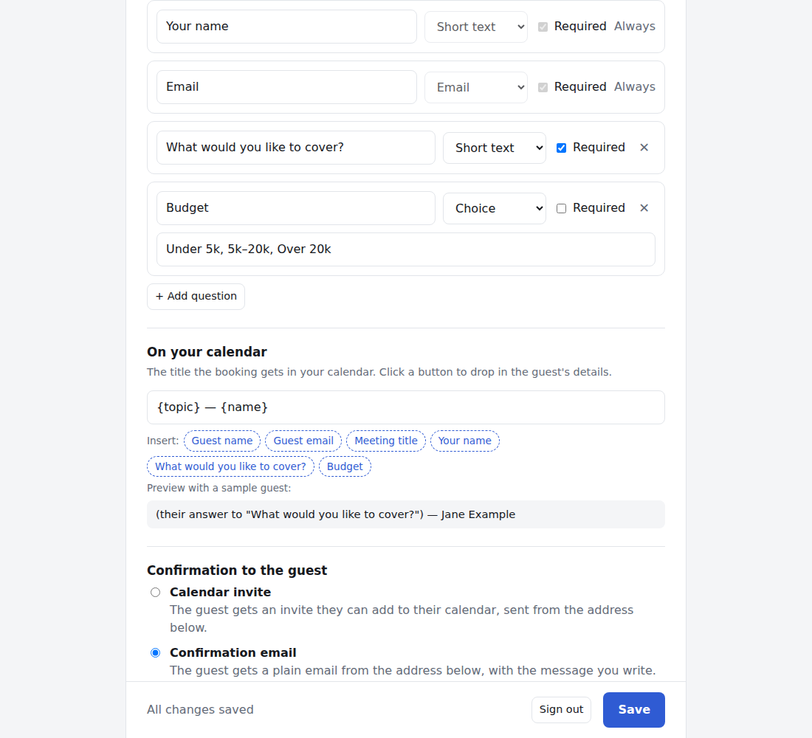
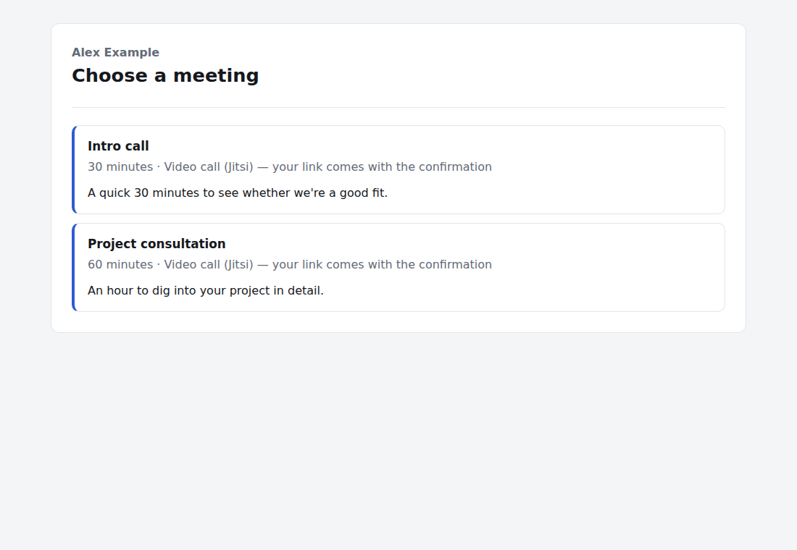
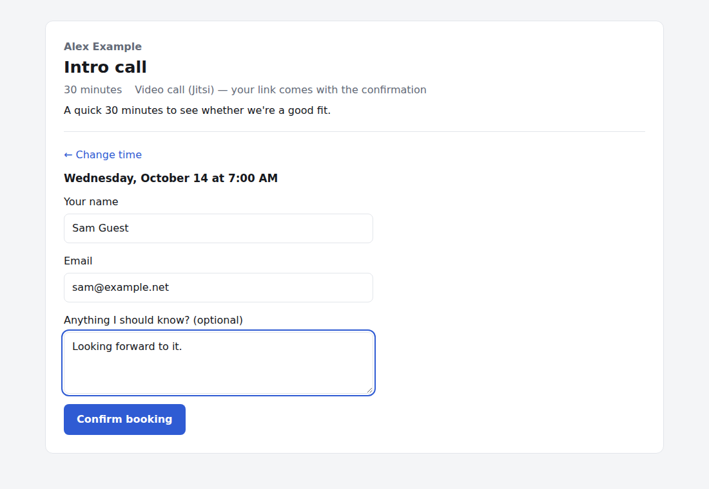
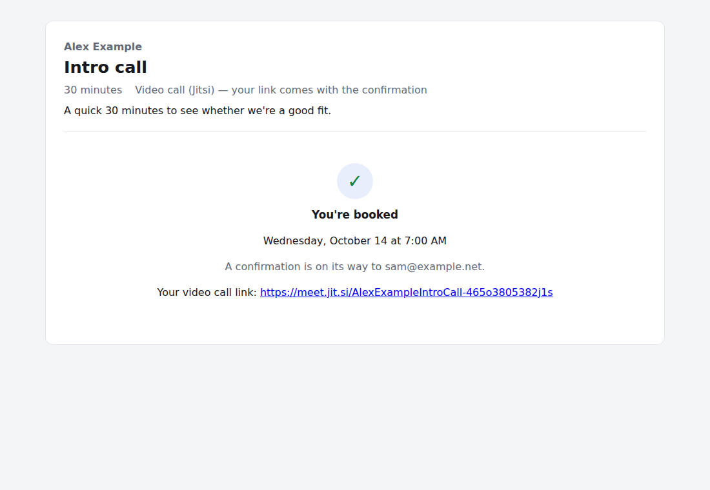

# Fastmail Booking Calendar

[](https://github.com/ashgoodman/fastmail-booking-calendar/actions/workflows/ci.yml)

A self-hosted booking page for your Fastmail calendar, like Calendly. Guests pick a meeting type and a free time, answer your questions, and the booking lands straight on your Fastmail calendar with an invite or a confirmation email. Each booking can get its own video-call link.

It runs on Cloudflare Workers and stays within Cloudflare's free plan for personal use. There's nothing to install for guests: they just open a link.



## Contents

- [Features](#features)
- [How it works](#how-it-works)
- [What you need](#what-you-need)
- [Installation](#installation)
- [Using it as the owner](#using-it-as-the-owner)
- [What your guests see](#what-your-guests-see)
- [Trying it without Fastmail](#trying-it-without-fastmail)
- [Updating](#updating)
- [Security and privacy](#security-and-privacy)
- [Limitations](#limitations)
- [Development](#development)

## Features

- **Several meeting types.** For example a 30-minute intro call and a 60-minute consultation, each with its own link, length, weekly hours, calendars, questions and confirmation.
- **Real availability.** Busy time is read live from the Fastmail calendars you choose. Events marked "Free" don't block anything. Bookings from all your meeting types never overlap each other.
- **Your rules.** Weekly hours per day, minimum notice, how far ahead people can book, free time before and after meetings, a daily cap, and days off.
- **Your questions.** Name and email are always asked. Add short or long text, phone, choice or checkbox questions.
- **Invite or email.** The guest gets either a calendar invite from your calendar or a plain confirmation email, from any of your Fastmail sending addresses or aliases.
- **Video calls.** Optionally, each booking gets its own private [Jitsi Meet](https://meet.jit.si) link.
- **Guests' timezones.** Guests see times in their own timezone and can switch it.
- **Cancellations.** Delete a booking in Fastmail and the time opens up again on your booking page by itself.
- **Your domain.** Serve it from something like `book.example.com`.

## How it works

```
 Guest's browser ──► Booking page ─┐
                                    ├─► Cloudflare Worker ──► Fastmail
 You ──────────────► Settings page ─┘        │                (CalDAV: calendars, busy time, events)
                                              │                (JMAP: confirmation emails)
                                              ▼
                                       Cloudflare D1
                                (settings and bookings)
```

- One Cloudflare Worker serves both pages and does all the work.
- Your settings and a record of bookings live in a small Cloudflare D1 database.
- The Worker reads busy time from Fastmail over **CalDAV**, using an app password. It creates the booking on your calendar the same way, and Fastmail sends the guest's invite itself.
- Confirmation emails go out over Fastmail's **JMAP** API, using an API token.
- The settings page never talks to Fastmail directly. It saves rules to the Worker, and every booking page picks them up on its next load.
- Every booking is checked again on the server against your rules and live calendar before it's accepted. Two people can never get the same slot.

## What you need

- **A Fastmail account on a Standard plan or higher.** The Basic plan can't create the app password needed for calendar access.
- **A Cloudflare account.** The free plan is enough.
- **Node.js 22 or newer** on the computer you set it up from.
- Optional: a domain on Cloudflare, if you want the pages on your own address.

## Installation

### 1. Get the code

```bash
git clone https://github.com/ashgoodman/fastmail-booking-calendar.git
cd fastmail-booking-calendar
npm install
```

### 2. Sign in to Cloudflare

```bash
npx wrangler login
```

This opens a browser window to approve access to your Cloudflare account.

### 3. Create your settings file and database

```bash
cp wrangler.example.toml wrangler.toml
npx wrangler d1 create fastmail-booking-calendar
```

The second command prints a `database_id`. Paste it into `wrangler.toml` in place of `PASTE-YOUR-DATABASE-ID-HERE`. Then set up the database tables:

```bash
npm run db:migrate
```

### 4. Create two Fastmail credentials

In Fastmail, go to **Settings → Privacy & Security → Connected apps & API tokens**.

1. **App password** (calendar access)
   - Choose **Manage app passwords and access → New app password**.
   - Leave the access as **Mail, Contacts & Calendars** and generate it.
2. **API token** (sending confirmation emails)
   - Choose **Manage API tokens → New API token**.
   - Pick the **JMAP** type, tick **Email** and **Email submission**, and generate it.

Copy each one when it's shown, because Fastmail only displays it once.

### 5. Store your secrets in Cloudflare

Run each command and paste the value when asked. Secrets are stored encrypted in Cloudflare, never in your files.

```bash
npx wrangler secret put FASTMAIL_USER
```

That one is your Fastmail login email address. Next, the app password from step 4:

```bash
npx wrangler secret put FASTMAIL_APP_PASSWORD
```

Then the API token from step 4:

```bash
npx wrangler secret put FASTMAIL_API_TOKEN
```

Finally, an admin key: a long password you choose for the settings page. Keep it somewhere safe.

```bash
npx wrangler secret put ADMIN_KEY
```

### 6. Deploy

```bash
npm run deploy
```

Wrangler prints your address, something like `https://fastmail-booking-calendar.<your-subdomain>.workers.dev`. Open **`/admin/`** on that address and sign in with your admin key.

### 7. Optional: use your own domain

If your domain is on Cloudflare:
1. Uncomment the `routes` line in `wrangler.toml` and set your subdomain, for example `book.example.com`.
2. Run `npm run deploy` again. Cloudflare creates the DNS record and certificate for you, which takes a minute or two.

## Using it as the owner

Everything is done on the settings page at **`/admin/`**. Changes take effect for guests as soon as you click **Save**.



### First-time setup

1. Under **About you**, enter your name as guests should see it, and your timezone.
2. Click **Edit** on the first meeting type and work through its sections, described below.
3. Tick **This meeting type is bookable** on each type you want to offer.
4. Back on the overview, tick **Accept bookings** and click **Save**.

Bookings are switched off until you do this, so you can set things up at your own pace.

### Meeting types

Each meeting type is a separate kind of booking with its own link, for example `/intro-call` or `/project-consultation`.
- **+ Add meeting type** creates one.
- **Duplicate** copies an existing one as a starting point.
- **Delete** removes one. Bookings already made stay on your calendar.

Untick **This meeting type is bookable** to pause one type. Untick **Accept bookings** on the overview to pause everything.



**The meeting**
- **Title**, **Description**, the **Link**, and the **Meeting length**.
- **Start times every** sets the spacing between slots: 30 means guests can start on the hour and half hour.
- **Where** is either a new Jitsi video link for every booking, or a location you type in, such as a phone number, an address or a fixed meeting link.

**When people can book**
- **Weekly hours, per day.** A day can have several blocks of hours, for example 9–12 and 14–17. Use **Copy to Mon–Fri** or **Copy to all days** to repeat one day's hours.
- **Minimum notice:** how soon before a meeting it can be booked.
- **How far ahead:** how many days into the future guests can book.
- **Free time before / after:** keeps a gap around each meeting so nothing is booked back to back with it.
- **Max of these per day:** caps how many of this meeting type can be booked on one day. 0 means no limit.

**Days off** on the overview page block every meeting type on those dates.

**Calendars**
- **Put these bookings on:** the Fastmail calendar new bookings are added to. It's always checked for clashes too.
- **Also block times that are busy on:** tick any other calendars that should make you unavailable, for example a personal calendar. Events marked "Free" in Fastmail never block anything.

**Questions for guests**
- Name and email are always asked.
- Add your own questions with **+ Add question**: short text, long text, email, phone, a choice from a list, or a checkbox. Each can be required or optional.

**On your calendar**

This is the title the booking gets in your calendar. Click the buttons to insert details, such as **Guest name**, **Meeting title** or the answer to any of your questions. The preview shows how it will look with a sample guest.



**Confirmation to the guest**

Pick one of the two:
- **Calendar invite:** Fastmail sends the guest a standard invite they can add to their own calendar, and their reply comes back to you.
- **Confirmation email:** the guest gets a plain email with a message you write, with the same insert buttons, plus **Date & time** and **Video link**.

**Send from** picks which of your Fastmail sending addresses the invite or email comes from. If you have a wildcard address such as `*@example.com`, you can type any address on that domain.

### Sharing your links

- **The main link** (the address of your booking page, ending in `/`) lists every bookable meeting type. If only one is bookable, it goes straight to it.
- **Each meeting type's own link** goes directly to that type. Use **Copy link** on the overview to grab one.

### When someone books

- The meeting appears on your chosen Fastmail calendar. The guest's answers are in its notes, plus the video link if you use one.
- The guest receives the invite or email you chose.
- The booking appears under **Upcoming bookings** on the settings page.

### Cancelling or moving a booking

- **To cancel:** delete the event in Fastmail. If you used invite mode, Fastmail sends the guest a cancellation automatically. If you used email mode, let the guest know yourself. Either way, the time becomes bookable again within a minute.
- **To move a booking:** change the event in Fastmail. In invite mode, Fastmail emails the guest the update.

### Video calls with Jitsi

When **Where** is set to Jitsi, every booking gets a private room link such as `https://meet.jit.si/AlexExampleIntroCall-k3j9x2m4q1ab`.
- Guests join from their browser with no account.
- To start the call, you, as the first person in, sign in to meet.jit.si with Google, GitHub or Facebook. Jitsi requires this since 2023.

### Changing the admin key

```bash
npx wrangler secret put ADMIN_KEY
```

The old key stops working immediately. Sign in again on the settings page with the new one.

## What your guests see

**1. Choose a meeting.** The main link lists your bookable meeting types. A meeting type's own link skips this step.



**2. Pick a day and time.**
- Days with free times are highlighted.
- Times are shown in the guest's own timezone, which they can change under "Times shown in".
- Only times that fit all your rules and are free on your calendars appear.

**3. Enter their details** and answer your questions.



**4. Confirm.**
- The booking is confirmed on screen, with the video link if there is one.
- The guest then receives the calendar invite or confirmation email.
- If someone else took the time a moment earlier, the guest is asked to pick another.



**Guests don't need an account** and see nothing of your calendar except which times are free. To cancel or change a booking, a guest can decline the calendar invite or reply to the email. You then remove or move the event in Fastmail.

## Trying it without Fastmail

You can run everything on your own computer against a stand-in calendar. It has made-up busy times, and nothing is sent: invites and emails are shown in a "Demo outbox" on the settings page.

```bash
cp wrangler.example.toml wrangler.toml
echo 'ADMIN_KEY=choose-a-local-key' > .dev.vars
npm run db:migrate:local
npm run dev
```

Then open the address it prints, usually `http://localhost:8787/admin/`, and sign in with that key. The `database_id` placeholder is fine for local use.

## Updating

```bash
git pull
npm install
npm run db:migrate
npm run deploy
```

`db:migrate` only applies database changes you haven't had yet, so it's safe to run every time. Your settings and bookings are kept.

## Security and privacy

- **Secrets stay in Cloudflare.** Your Fastmail credentials and admin key are encrypted Worker secrets. They're never sent to the browser or stored in the repository.
- **The settings page requires the admin key.** The key is checked on the server for every change, and your browser remembers it until you sign out.
- **Guests see only what they need.** They see your free times, never event titles or details. The video link is only revealed after booking.
- **Abuse limits.** Each visitor is rate-limited when loading times and when booking, and a hidden form field turns away simple bots.
- **What's stored.** Your settings, plus a record of each booking: its time and the guest's answers. These are kept in your own Cloudflare D1 database. A booking you delete from your calendar is removed from it too.
- **Keep secrets out of public repos.** `wrangler.toml` and `.dev.vars` are git-ignored, so they stay off GitHub if you fork this repository.

## Limitations

- **Guests can't cancel or reschedule themselves.** They do it through the invite or by emailing you.
- **One Fastmail account per deployment.** To run booking pages for several people, deploy it more than once.
- **No paid bookings, reminders or group meetings.**
- **Jitsi needs a host sign-in.** You need a Google, GitHub or Facebook login to start Jitsi calls on meet.jit.si.
- **Very large numbers of meeting types or calendars aren't tested.** The settings allow up to 50 meeting types.

## Development

```
src/
  index.js            routes, booking rules, settings API
  config.js           settings validation and defaults
  slots.js            turns weekly hours into slots and removes busy time
  time.js             timezone conversion without libraries
  providers/
    fastmail.js       CalDAV (calendars, busy time, events) and JMAP (email)
    demo.js           stand-in calendar for local testing
public/
  index.html          guest booking page
  admin/index.html    owner settings page
  style.css
migrations/           D1 database schema
test/                 unit tests (npm test); test/integration/ runs the real server
```

- `npm test` runs the unit tests: booking rules and the Fastmail code against recorded server replies.
- `npm run test:integration` starts the real server locally on the stand-in calendar and books through it.
- `npm run check` confirms the server bundles for deployment.
- `npm run dev` runs locally with the stand-in calendar.

GitHub Actions runs all of these on every push and pull request.

There are no runtime dependencies: plain JavaScript on Cloudflare Workers.

## License

[MIT](LICENSE)
